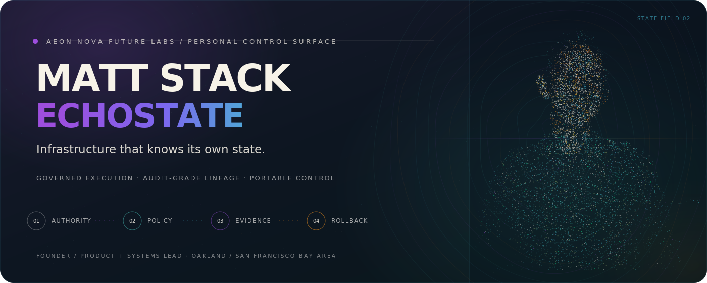

  
  

    <a href="https://aeonnova.ai/">Website</a> ·
    <a href="https://github.com/AeonNovaFutureLabs">Aeon Nova Future Labs</a> ·
    <a href="https://www.linkedin.com/in/matt-s-233843aa/">LinkedIn</a> ·
    <a href="mailto:matt@aeonnova.ai">Email</a>
  

## State, not story.

I build governance-first infrastructure for autonomous systems. My current focus is **EchoState**: governed state, evidence, and rollback for machine action.

- **Policy before execution** — authority and scope are explicit.
- **Evidence with every state change** — actions remain attributable and reviewable.
- **Rollback or remediation by design** — failure paths are part of the contract.

Active implementation repositories remain private while release boundaries and public proof surfaces are consolidated.

## Background

Before founding Aeon Nova Future Labs, I worked across complex manufacturing and national rollout programs, including Tesla and ChangeUp. That operating experience informs the work: ownership should be explicit, dependencies visible, and recovery paths designed in from the start.
