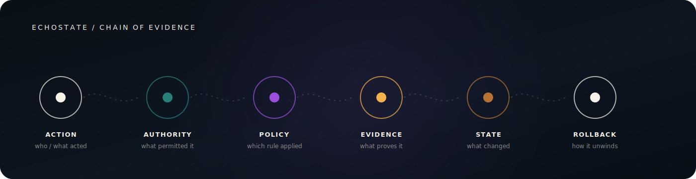
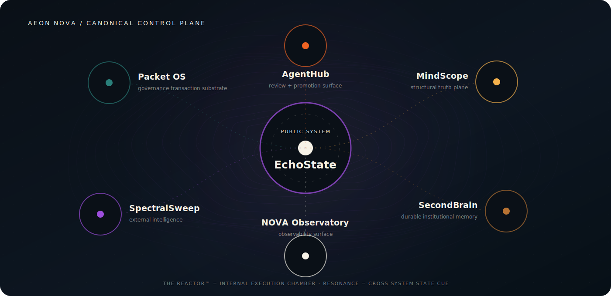
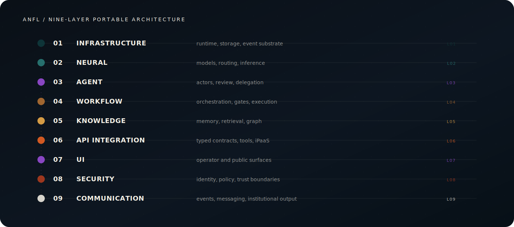
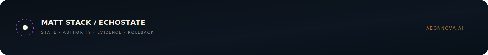

<!--
File: README.md
Location: /MattSStack/README.md
Purpose: Public GitHub profile landing page for Matt Stack
Security Level: Public
Owner: Matt Stack
Version: 1.1
Last Modified: 2026-07-10
Profile Index Refresh: 2026-07-10T22:13:49-0700
Component: mattsstack_github_profile
Position: A-Position
Layer: 09 (Communication)
ASB Specification: 09_00_00
-->

<div align="center">
  
</div>

<p align="center">
  <a href="https://aeonnova.ai"></a>
  <a href="https://github.com/AeonNovaFutureLabs"></a>
  <a href="https://www.linkedin.com/in/matt-s-233843aa/"></a>
</p>

## State, not story.

I build portable, governance-first AI infrastructure for systems that can act, spend, route, approve, modify, and commit institutional state. My current focus is **EchoState**: the operational state plane that makes autonomous execution governed, inspectable, attributable, and reversible.

<table>
<tr>
<td width="33%" valign="top"><strong>Governed execution</strong><br/><sub>Authority, policy, permissions, and trust boundaries before action.</sub></td>
<td width="33%" valign="top"><strong>Audit-grade lineage</strong><br/><sub>Evidence across models, data, tools, agents, workflows, and state transitions.</sub></td>
<td width="33%" valign="top"><strong>Portable control</strong><br/><sub>Repo-first architecture, typed contracts, model-agnostic execution, and explicit rollback.</sub></td>
</tr>
</table>

<div align="center">
  
</div>

## Current system map

**Aeon Nova Future Labs** is the parent architecture. **EchoState** is the public product face. The surrounding systems provide governance, structural truth, institutional memory, intelligence, observability, and review without competing for the hero position.

<div align="center">
  
</div>

| System | Role |
|---|---|
| **Packet OS** | Governance transaction substrate |
| **EchoState** | Operational state plane and public control surface |
| **MindScope** | Structural truth, dependency, and fit graph |
| **SecondBrain** | Durable institutional memory and synthesis |
| **SpectralSweep** | External intelligence, ranking, contradiction, and novelty |
| **NOVA Observatory** | Operations and observability surface |
| **AgentHub** | Agent review graph and promotion queue |
| **The Reactor™** | Internal execution and configuration chamber |

## Architecture posture

<div align="center">
  
</div>

```yaml
working_defaults:
  architecture: "portable, repo-first, nine-layer"
  contracts: "typed and inspectable"
  execution: "model-agnostic"
  governance: "pre-commit, evidence-backed, rollback-aware"
  state_of_truth: "one canonical source per concern"
  public_claims: "proof before metrics"
```

## What I am building toward

An institutional control plane for autonomous systems where every meaningful action can answer five questions:

1. Who or what acted?
2. Under what authority?
3. Which policy governed the action?
4. What evidence proves the resulting state?
5. What rollback or remediation path existed?

Most active implementation repositories remain private while public proof surfaces, release boundaries, and documentation are consolidated. I do not use placeholder traction, synthetic deployment counts, or decorative activity metrics here.

## Background

Before ANFL, I worked across complex manufacturing and national rollout programs, including Tesla and ChangeUp. That operating background informs the architecture: state must be legible, ownership must be explicit, dependencies must be visible, and failures need controlled recovery paths.

<details>
<summary><strong>Open the Braille / stipple terminal portrait</strong></summary>

<pre>
                     ⢀⢄⣤⣄⣀
                  ⢀⢔⣵⣽⣿⣿⣿⣿⣿⣄ ⠄
                 ⢔⣵⣽⣿⣿⣿⣿⣿⣿⣿⣿⣷⠄
                ⢀⢔⠟⣿⣿⣿⣟⣿⣿⣿⣿⣿⣿⣕⠄
             ⣠⡄ ⠘⢵⣿⣿⣟⢙⣿⣿⣿⣿⢿⣷⣷⣵⠁
            ⢸⣿⣷⡀⢐⢽⣿⣿⣿⣿⣿⣿⣿⣿⢿⣅⣿⢽⠁
            ⠈⢿⣿⣇⠝⢽⣿⣿⣿⣿⣿⣿⣿⣿⣿⣿⣿⣿ ⡄
              ⠻⠷⢱⣿⣿⣿⣿⣿⣿⣿⣿⣿⣿⣿⣿⡇⣰⠁
                ⠘⣿⣿⣿⣿⣿⣿⣿⣿⣿⢻⣿⣿⠅⠁
                ⢀⠙⢿⣿⣿⣿⣿⣿⣿⣿⣿⣿⠟
                ⢸⣷⠌⠙⢿⣿⣿⣿⣿⣿⠟⠁
                ⢸⣿⣷⣵⣤⣭⣝⠛⠛⢁⡔
              ⢀⠤⢝⣿⣿⣿⣿⣿⣿⣿⣿⣿⣗⠸⢵⡄
             ⢤⢵⢔⢽⣽⣿⣿⣿⣿⣿⣿⣿⣿⣿⣅⢽⣧⣀⣷⣶⡄ ⣤⣄
          ⠐⠄⠕⠕⢿⣽⢿⣽⢿⣿⣿⣿⣿⣿⣿⣿⣿⣿⣿⣿⣿⠍⠝⢝⠙⠝⢝⠄⠁
      ⠁ ⠁⠄⠁⢄⠁⢅⠝⢿⣿⣿⣿⣿⣿⣿⣿⣿⣿⣿⣿⣿⣿⠟⠁⢅⠕⢅⠕⢅⠕⠕⠕⠄⠁
      ⠁ ⠁⠅⠅⢅⠅⢅⢕⠅⠝⢝⠟⢿⢿⢿⢿⢿⢿⠟⠟⠍⠕⢕⢕⢅⠕⢅⠕⠅⢕⠕⠕⠕⠅⠁⠅⠄
        ⠁⠅⠅⠅⠅⢅⠕⠕⢕⢅⢝⢅⠙⢅⢕⠕⢕⢥⠕⢥⢕⢵⠕⢕⠕⢅⠅⠅⠅⠕⠕⠅⠅⢕⠅
      ⠁⠄⠁⠄⠁⠅⠕⢅⢁⢕⠕⢕⢝⢕⠝⢕⢕⢅⢕⢕⢕⢝⢝⢅⢕⢕⢕⢅⠅⢅⢕⠁⠑⠅⠁⠄⠕ ⠁
      ⠁⠄⠕⠄⠕⠕⢕⢅⠝⢕⢝⢕⠝⢝⢝⢵⢝⢵⢽⢵⢝⢽⢝⢝⢕⢕⢽⢕⠕⢕⢕⢕⢕⢅⠕⠄⠑⠄⠁
    ⠅⠁⠁⠅⠁⠅⠅⠅⠅⠅⠝⢅⠕⢕⠕⢅⢕⢕⢝⢝⠽⢕⢝⢽⢝⢽⢝⢵⢕⢕⢅⠕⠕⢕⠕⠅⠕⠄⠅
     ⠅⠁⠅⠁⠁⠑⢅⠁⢕⠕⢅⠝⢕⠝⢕⢕⢕⢝⢕⢕⢅⠕⢵⢝⢕⢝⢕⠕⢥⢕⢕⠕⠅⠑⠅⠁⠁⠁⠄
      ⠁⠅⠁⠅⠁⠅⠅⠅⠅⢅⢅⢅⠝⠕⠕⢕⢝⢕⠕⢕⢝⠕⠕⢕⠝⢕⠕⢵⠕⢅⠕⠅⠁ ⠄
        ⠁⠁⠁⠅⠁⠅⠑⢅⢅⢕⢕⢕⠕⢕⠕⢕⠕⢅⢝⢕⠕⢕⢕⢕⠕⢕⠕⠅⠕⠅  ⠁
        ⠁ ⠁⠅⠅⠄⠅⠅⠅⢅⠕⢕⠑⢕⠕⢕⢕⠕⠕⢅⠕⢕⠝⢅⠕⠅⠅⠅⠕⠅⠁
             ⠅⠑⠅⠅⢅⠑⢅⠅⢅⢕⢕⠕⢅⠕⢅⠕⢄⠕⢅⠕⠅⠕⠅⠁
            ⠁ ⠑⠅⠁⠅⠕⠅⠅⠅⠕⠕⠕⠅⠕⢕⠝⢑⠕⠅⠕⠅⠁⠅
          ⠁  ⠄ ⠄⠁⠄⠅⠅⠅⠅⠕⠕⠅⠅⠕⢅⠕⠅⠕⠅⠑⠁⠁ ⠁
                   ⠁⠁⠁ ⠁⠁⠅⠁⠅⠁ ⠁⠁⠁⠅
                    ⠁   ⠁ ⠁ ⠁⠁
</pre>

</details>

## Contact

- **Web:** [aeonnova.ai](https://aeonnova.ai)
- **GitHub:** [@AeonNovaFutureLabs](https://github.com/AeonNovaFutureLabs)
- **LinkedIn:** [Matt Stack](https://www.linkedin.com/in/matt-s-233843aa/)
- **Email:** [matt@aeonnova.ai](mailto:matt@aeonnova.ai)

<div align="center">
  
</div>
